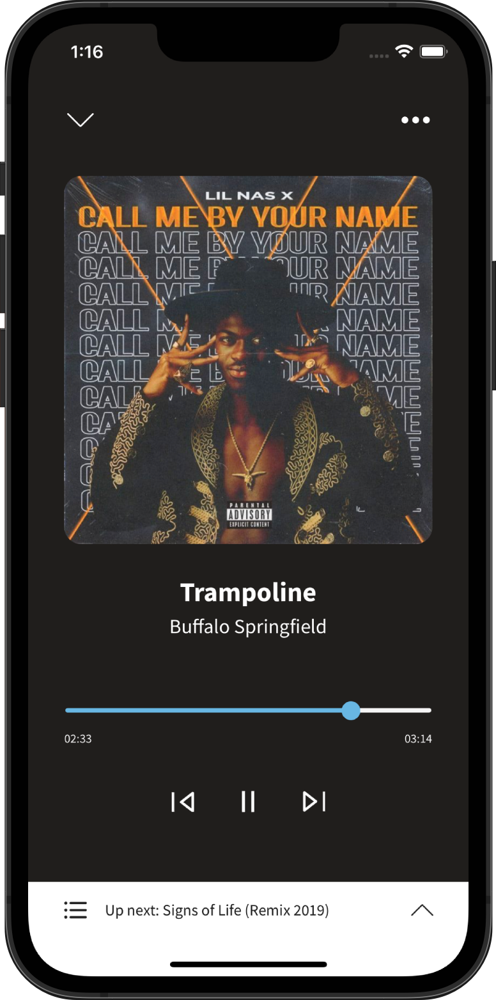
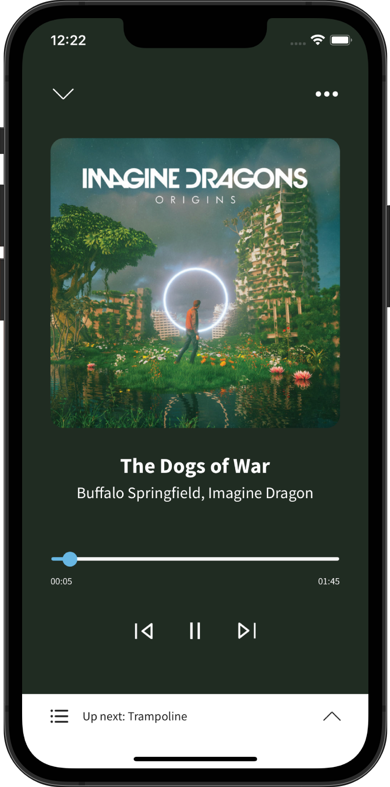

# ESAudioPlayer

[](https://cocoapods.org/pods/ESAudioPlayer)
[](https://cocoapods.org/pods/ESAudioPlayer)
[](https://cocoapods.org/pods/ESAudioPlayer)

 

## Example

To run the example project, clone the repo, and run `pod install` from the Example directory first.

## Requirements
* Swift version 5
* iOS 13 or higher
* Dependency on RxSwift as it's used to make player reactive

## Installation

ESAudioPlayer is available through [CocoaPods](https://cocoapods.org). To install
it, simply add the following line to your Podfile:

```ruby
pod 'ESAudioPlayer'
```

## Author

Mario Mouris, mario.mouris@extremesolution.com

## License

ESAudioPlayer is available under the MIT license. See the LICENSE file for more info.
