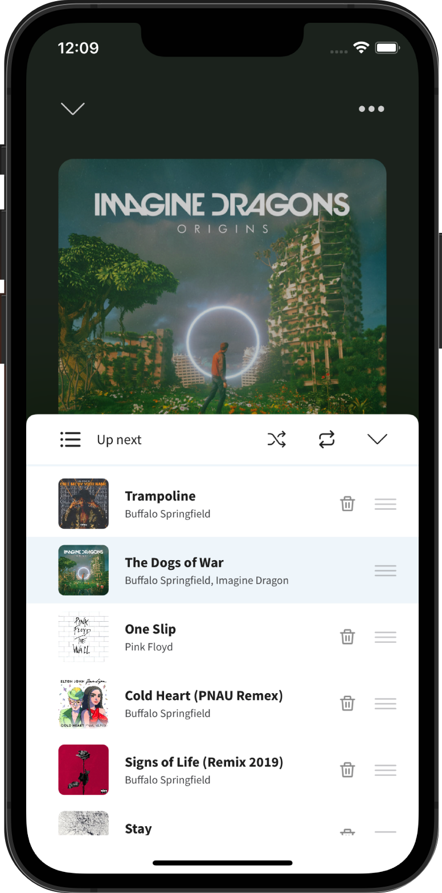

# ESAudioPlayer: A reactive audio player for iOS

[](https://cocoapods.org/pods/ESAudioPlayer)
[](https://cocoapods.org/pods/ESAudioPlayer)
[](https://cocoapods.org/pods/ESAudioPlayer)

ESAudioPlayer is a reactive audio player for iOS using RxSwift. It provides basic audio management features like playing an audio from a URL. And some more advanced features like queue management, MediaPlayer transport controls and now playing center info.

 

## ⚙️ Features
- [x] Completely abstracted player details, only reactive layer is exposed for use
- [x] Optimized performance for managing long queues
- [x] Basic track management (Play, pause, resume)
- [x] Queue management (Shuffle, repeat, next, previous, etc...)
- [x] Speed management
- [x] Seek forward, backwards or to a specific point
- [x] Handle remote command center actions (Play, pause, next, previous, change playback position)
- [x] Handle updating now playing center

## 📝 Requirements
* Swift version 5 or higher
* iOS 13 or higher
* Dependency on RxSwift as it's used to make player reactive

## ⬇️ Installation
ESAudioPlayer is available through [CocoaPods](https://cocoapods.org). To install
it, simply add the following line to your Podfile:

```ruby
pod 'ESAudioPlayer'
```

## 📱 Example
To run the example project, clone the repo, and run `pod install` from the Example directory first.

## 🗝 How to use ESAudioPlayer?
1. Use the `shared` instance of `ESAudioPlayer`, creating a new instance is disabled.
2. Pass a track or a list of tracks to play through the `play(track:)` or `play(list:)`, which take `ESPlayerAudioTrack` object.
3. Subscribe to the changes your interested in:
    * `state`: Returns the player's current state (playing, buffering, paused, stopped, error)
    * `currentTrack`: Returns the track that is currently in the player (Whether it's playing or paused)
    * `queue`: Returns the queue that is currently in the player
    * `currentTime`: Returns the current position of the player in minutes and seconds
    * `trackDuration`: Returns the full time of the player in minutes and seconds
    * `currentSpeed`: Returns the currently selected playback speed
    * `isRepeatOn` & `isShuffleOn`: Returns whether the repeat or shuffle are turned on or not respectively


## 👨🏽‍💻 Author
Mario Mouris, mario.mouris@extremesolution.com

## 📄 License
ESAudioPlayer is available under the MIT license. See the LICENSE file for more info.
